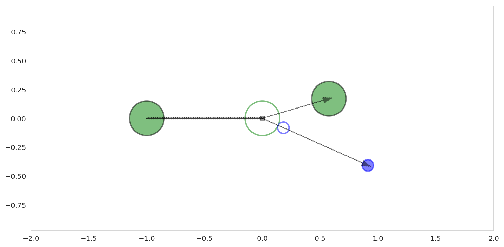

# Ion Mobility Calculator
## The following scripts aim to provide an introduction to mobility calculations from drift cell systems but also, and perhaps most importantly, a mechanism to calculate mobility based upon a revised momentum transfer theory by Siems, Viehland, and Hill.

Key equations include:

